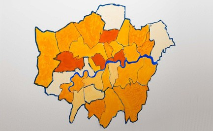
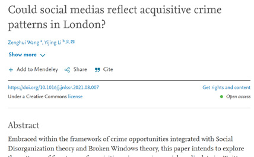

# Transformational Outcomes

<table>
  <tr>
    <td>  </td>
    <td> 
      CUSP London generates many forms of output, both traditional academic work and broader engagements with external partners. 
    </td>
   </tr> 
  
   <tr>
    <td>  </td>
    <td> 
      Academic outputs including journal articles and research grants from EPSRC, The Turing Institute, Research England and others.
    </td>
   </tr> 
  
</table>

## More Information
This is currently a test page.
