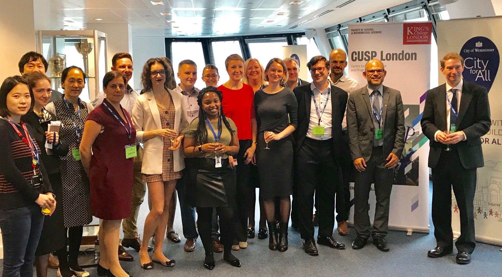

# Partnerships and Engagement

Engagement with external partners is central to CUSP London activities, this provides real world context for research projects, supports placements, leads to employment opportunities and delivers value to our partners including access to the latest digital skills.

*Group photo taken in 2018 at the official signing of the Statement of Intent between CUSP London and Westminster City Council.* 

> One of the big wins from working with CUSP London, was that we got the Data Strategy arranged and open data is now in our City for All Strategy, which is a big culture change for us, really important.

*Dr Sophie Johnson, Deputy Chief Analyst, Westminster City Council*

## More Information
This is currently a test page.
